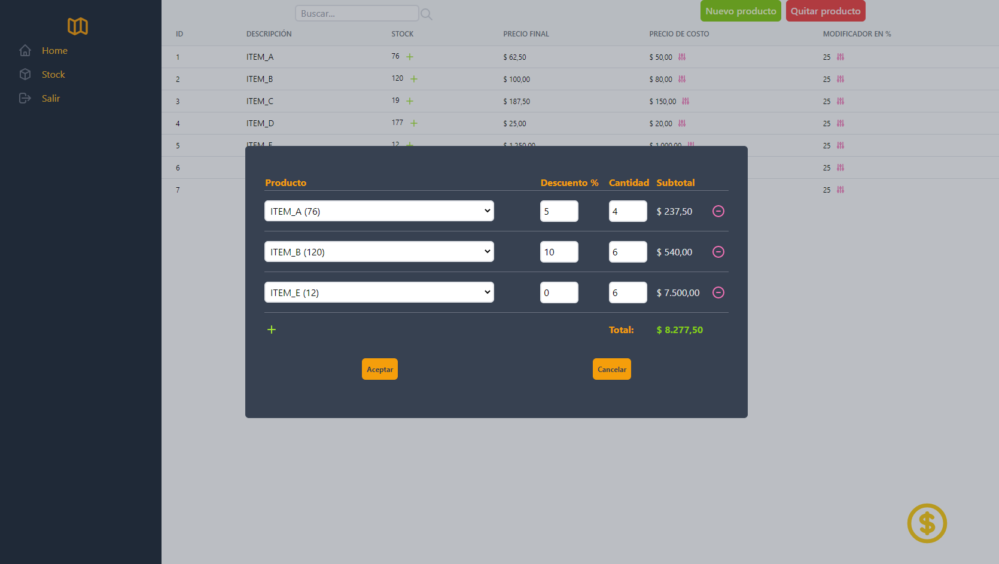

# StockTracker (en desarrollo)
  Proyecto personal.   
  App simple para manejo de un negocio.  
  Venta, actualización de stock , alertas y estadísticas. 
  # Objetivos
    Materializar todos los conocimientos aprendidos en mi formación y futuros, en un proyecto en constante expansión usando las mejores prácticas y estandares de la industria.
 # Client
   Frontend realizado con React, Tailwind CSS, ApexCharts.js y principios UX/UI
   
 # Server 
   Backend realizado con Express.js aplicando los principios SOLID y el paquete RSDI (Dependency injection container) para lograr una arquitectura MVC escalable y mantenible en el tiempo.   
   Persistencia de datos implementada con el ORM squelize(sqlite) mediante un Repository Pattern. 
   
  
  
  
   
  
  
  
